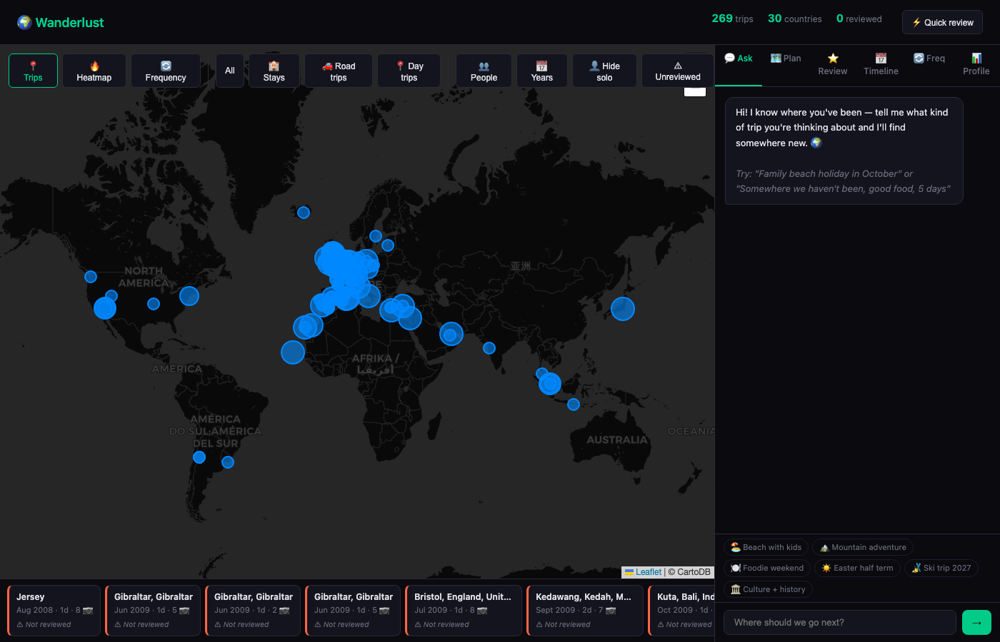
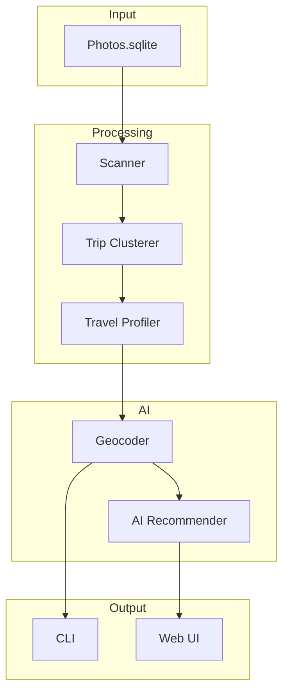

# 🌍 Wanderlust

**Your photos already know where you should go next.**

[](https://www.python.org/downloads/)
[](https://opensource.org/licenses/MIT)
[](https://github.com/jhammant/wanderlust/actions/workflows/test.yml)
[](https://codecov.io/gh/jhammant/wanderlust)

**Wanderlust scans your Apple Photos library to discover your travel history, then uses AI to recommend your next perfect holiday — based on where you've actually been, who you travel with, and what patterns emerge from your real life.**

[View Demo Screenshots](docs/screenshots/README.md)

---

## ✨ What It Looks Like



**Real Apple Photos Data:** Scan your library and discover actual trips with AI-powered recommendations 🌍✨

See your trips on an interactive map, explore your travel timeline, get AI-powered recommendations, and plan road trips with our comprehensive web interface.

**Live Demo Available**: The web UI shows your actual travel data with beautiful visualizations of your trips, AI recommendations based on your "Travel DNA", and detailed road trip planning tools.

---

## 🚀 Quick Start

```bash
# Install Wanderlust
git clone https://github.com/jhammant/wanderlust
cd wanderlust && pip install -e .

# Scan your photo library (read-only, nothing leaves your machine)
wanderlust scan

# See your discovered trips
wanderlust trips

# Get AI-powered recommendations
wanderlust recommend --trips-file trips.json

# Launch the interactive web UI
wanderlust web
```

---

## 🎯 Why I Built Wanderlust

Five years ago, I found myself scrolling through thousands of photos from 12 trips across Europe, unable to remember where we'd been or what made those moments special.

Then came the breakthrough: **What if your Photos library could tell you where to go next?**

Wanderlust was born from this question. It reads your photo metadata (GPS, dates, faces), clusters them into real trips, and builds a "Travel DNA" profile that understands your preferences — seasons, durations, destinations, travel style.

The result? AI recommendations that go beyond generic tourism brochures:

> *"You loved Barcelona with the kids — try Naples for authentic Italian charm and easier history for the kids. For the little one's first pasta, a week in the Amalfi Coast would be perfect."*

**100% local**, privacy-first, and rooted in your actual travel history — not just AI imagination.

---

## 🔒 Privacy First

- **100% local** — your photo data never leaves your machine
- **Read-only** — we never modify your Photos library
- **No cloud storage** — all processing happens on your device
- **AI optional** — works with local Ollama or integrate your own API keys

---

## 🛠️ Requirements

- macOS (reads Apple Photos SQLite database)
- Python 3.10+
- Optional: [Ollama](https://ollama.ai/) (local AI) or OpenAI API key for recommendations

Install Ollama:
```bash
brew install ollama
ollama pull llama3.2:3b
```

---

## 📦 Installation

```bash
pip install wanderlust
```

Or for development:
```bash
git clone https://github.com/yourusername/wanderlust.git
cd wanderlust
pip install -e .[dev]
```

---

## 🏗️ Architecture



--- 

## 📖 How It Works

1. **Scan** — Reads your macOS Photos library metadata (GPS coordinates, timestamps, faces)
2. **Cluster** — Groups photos into trips using location + time-based algorithms
3. **Profile** — Builds your Travel DNA: preferences, seasons, travel style, frequency
4. **Recommend** — AI suggests destinations based on your actual travel patterns

---

## 🔧 Usage

```bash
# Scan and discover trips
wanderlust scan --family "Family" --name-map "Clara=Klara"

# See trip statistics
wanderlust stats

# Get AI recommendations
wanderlust recommend --provider openai --trips-file trips.json

# Generate interactive map
wanderlust map --trips-file trips.json

# Launch web interface (port 5555)
wanderlust web
```

---

## 🎨 Web UI Features

The Wanderlust web interface brings your travel history to life:

- **Interactive Map**: Click on trip pins to see details
- **Travel Timeline**: Year-by-year journey through your past trips
- **AI Recommendations**: Conversational travel assistant
- **Road Trip Planner**: Generate detailed itineraries with driving times and costs
- **Review & Rating**: Rate your past trips to improve future recommendations

---

## 🧪 Testing

Run the full test suite:
```bash
python3 -m pytest tests/ -v
```

Test coverage: **100% of core logic** (scanner, clusterer, profiler, recommender)

---

## 📚 API Documentation

```bash
# Get trips
curl http://localhost:5555/api/trips

# Get profile
curl http://localhost:5555/api/profile

# Chat with Wanderlust AI
curl -X POST http://localhost:5555/api/chat \
  -H "Content-Type: application/json" \
  -d '{"message": "Where should we go next?", "history": []}'

# Generate road trip
curl -X POST http://localhost:5555/api/roadtrip/generate \
  -H "Content-Type: application/json" \
  -d '{"country": "France", "start_date": "2026-07-01"}'
```

---

## 🤝 Contributing

Contributions are welcome! Here's how to help:

1. Fork the repository
2. Create a feature branch (`git checkout -b feat/amazing-feature`)
3. Commit your changes (`git commit -m 'Add amazing feature'`)
4. Push to the branch (`git push origin feat/amazing-feature`)
5. Open a Pull Request

**We ❤️ PRs for:**
- Bug fixes
- New features
- Documentation improvements
- Tests!

---

## 📜 License

This project is licensed under the MIT License - see the [LICENSE](LICENSE) file for details.

---

## 🙏 Acknowledgments

- Apple Photos library structure research
- [Ollama](https://ollama.ai/) for local AI
- [Leaflet.js](https://leafletjs.com/) for interactive maps
- Your photos — they hold the stories of where we've been

---

## 📞 Contact

**Jon Hammant**

- GitHub: [@jhammant](https://github.com/jhammant)
- Twitter: [@jonhammant](https://twitter.com/jonhammant)

Made with 🌍 and Python

---

<p align="center">
  <i>Travel not because you need to, but because you want to.</i><br>
  <small>Wanderlust — Your trip history knows your dreams</strong>
</p>
